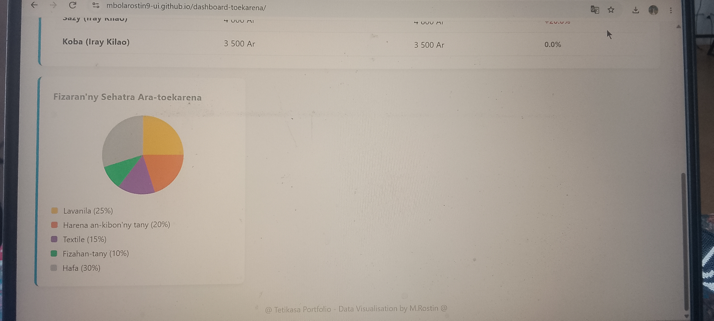

**📊 Tableau de Bord de l'Économie de Madagascar**

Ity dia tetikasa fampisehoana data (Data Visualisation) mikasika ny toekaren'i Madagasikara. Natao manokana hanehoana ny fahaizana mandamina tarehimarika saro-pantarina ho lasa fitaovana tsotra sy madio ho an'ny mpijery.

 **🚀 Rohy (Lien)**
Hijery ny Dashboard mivantana:https://mbolarostin9-ui.github.io/dashboard-toekarena/

**🛠️ Fitaovana Nampiasaina**
* **HTML5** (Tables ho an'ny fampitahana ny vidim-piainana PPN)
 * **CSS3** (Grid Layout ho an'ny dashboard, `conic-gradient` ho an'ny Kisary Boribory)

**📈 Inona no hita ao?**
* **Harinkarena Faobe (PIB):** Fampisehoana ny tarehimarika ankapobeny.
* **Fizaran'ny Sehatra:** Kisary boribory (Pie Chart) mampiseho ny isan-jaton'ny loharanom-bola.
* **Vidin'ny PPN:** Tabilao mampitaha ny vidim-piainana sy ny fiovan'izany (tahan'ny fidangan'ny vidim-piainana).
